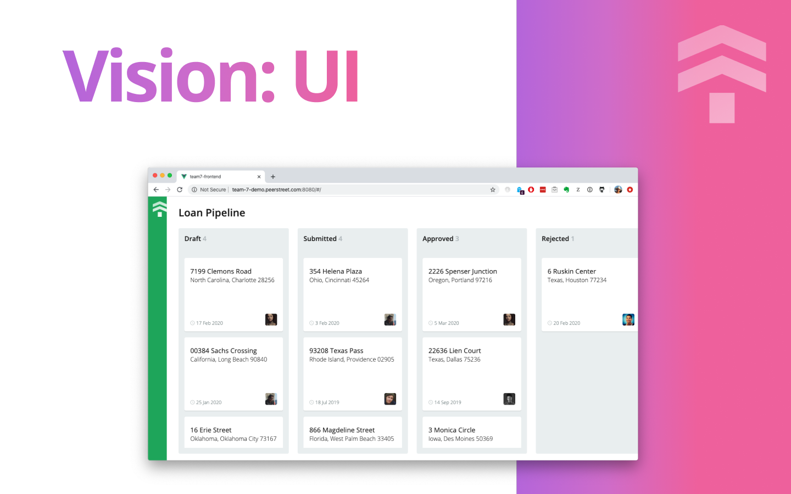

## PeerStreet Hackathon 2020 — Front-end

Our main idea was simple: we want to show that it's possible to separate
domain modal from implementation and maintain this model as the first-class project.
We created 3 repos connected:

1. **Domain model** (Protobuf 3 + Rake task to build Ruby gem and Js/Ts package): [0x000000/team7-domain](https://github.com/0x000000/team7-domain)
2. **Front-end** (Vue-cli + typescript): [Kaciaryna/team7-frontend](https://github.com/Kaciaryna/team7-frontend)
3. **Back-end** (Ruby + grpc): [0x000000/team7-backend](https://github.com/0x000000/team7-backend)

## Project Structure

Simple front-end implementation using Vue-cli and TypeScript.

Interesting stuff:

* `src/components` — Vue class components build with TypeScript.
* `src/utils/grpc.ts` —  Implementation for the typed grpc client.
* `src/router/*` — simple SPA router.
* `Hackstreet — Team7 Slides.pdf` — slides for the presentation.

### Setup

`yarn & yarn serve`
